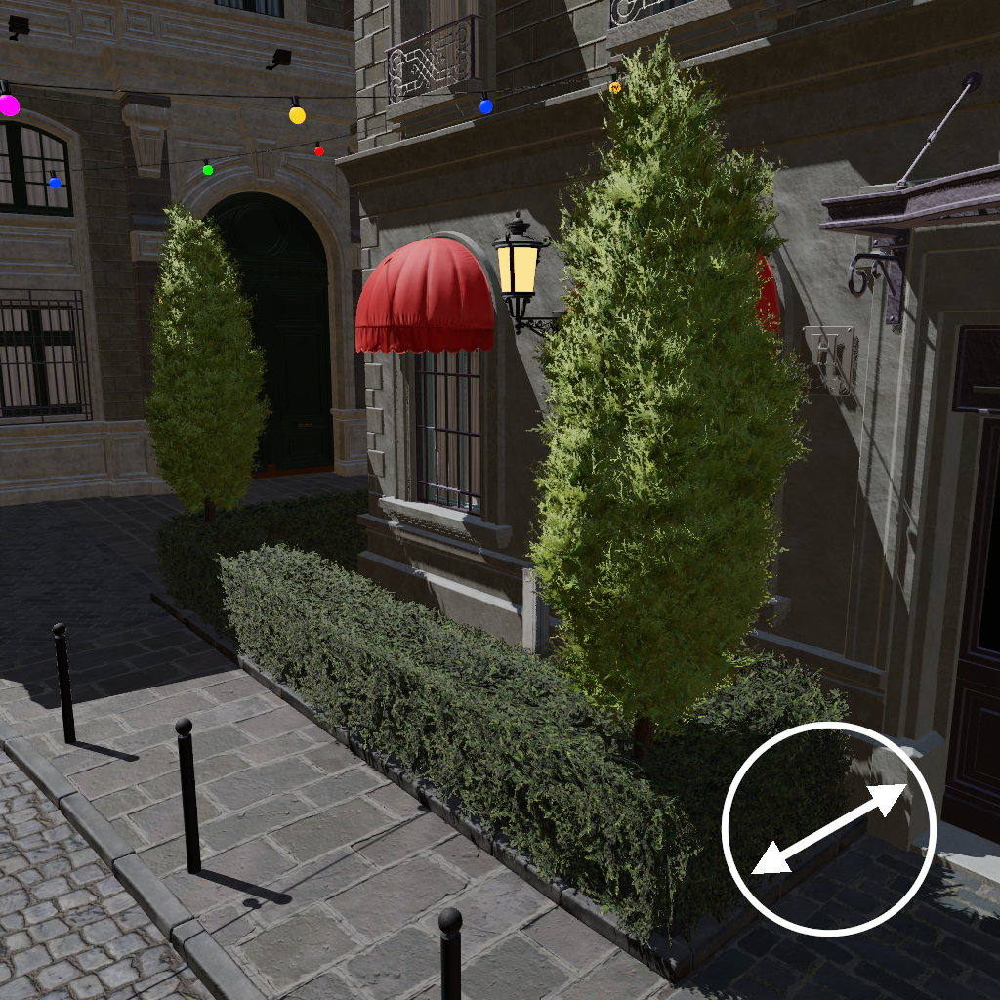

A Polarizing Filter Function for Real-Time Rendering
====
This repository hosts the source code of the example application used in the article _A Polarizing Filter Function for Real-Time Rendering_.


Polarizing Filter Demonstration
----
<p align="center">

|   |   |   |
|:-:|:-:|:-:|
| <br />Unfiltered| <br />Filter Angle = | <br />Filter Angle = |
| Unfiltered | Filter angle =  | Filter angle =  |
| Unfiltered | Filter angle =  | Filter angle =  |

</p>

Projects and Settings
----

TODO add link
This implmeentation is based on Nvidia's Falcor Rendering Framework 3.2.2 and adds the following projects.
- **PolarizingFilterRenderer** A copy of Falcor's _ForwardRenderer_ with an included polarizing filter.
	- **Settings**
		- _Polarizing Filter Angle_ The counterclockwise rotation angle of the linear polarizing filter in degrees, with `0` repressenting a horizontally angled filter.
- **MaterialRenderer** Can be used to compare the effect of our approximate function with the correct IOR-based function (see the article for more details). All diffuse lighting is turned off in this mode and all surfaces use the same material.
	- **Settings**
		- _Polarizing Filter Angle_ Same as above.
		- _Complex Index of Rerfaction_ Select from a predefined list of materials or manually set the complex refractive index of _all_ materials in the scene.
		- _Use as specular color_ Convert the IOR data to specular color and use the approximate functions instead of the exact ones.
		- _Show difference_ Show the exaggregated difference between the correct and the approximate results.

Polarizing Filter Source Code
----
The HLSL implementation code of the polarizing filter can be found in LINK, see the article for more details.

Requirements and Installation
----
Follow the installation guide for [Falcor 3.2.2](https://github.com/NVIDIAGameWorks/Falcor/tree/f2b53b1bb9f8433f3c9e2570d2dc90dcd2440415) if you want to build this project. 
The same restrictions and requirements apply.

Additional test scenes can be downloaded from the [Open Research Content Archive (ORCA)](https://developer.nvidia.com/orca). You might have to edit some path names in the code for them to load correctly.
Scenes can also be created/modified with the included `SceneEditor` project.

Versions
-----
- [`v1.00`](https://github.com/viktor4006094/DegreeProject/releases/tag/v1.00) Version used to run the performance tests in the article

Citation
--------

### Article
TODO

### Application
```bibtex
@Misc{EnfeldtPolarizing2020,  
   author = {Enfeldt, Viktor},  
   title  = {A Polarizing Filter Function For Real-Time Rendering},  
   year   = {2020},  
   month  = {08},  
   url    = {https://github.com/viktor4006094/DegreeProject},    
}
```
