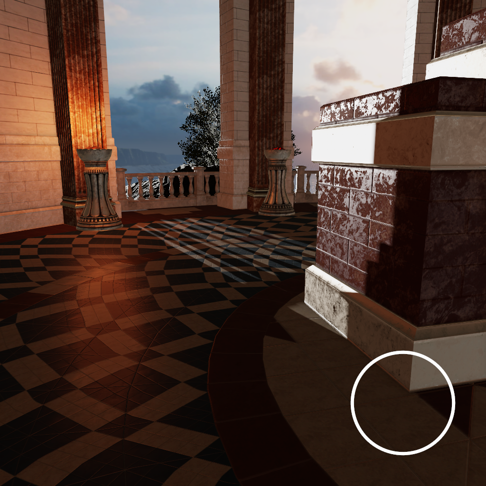
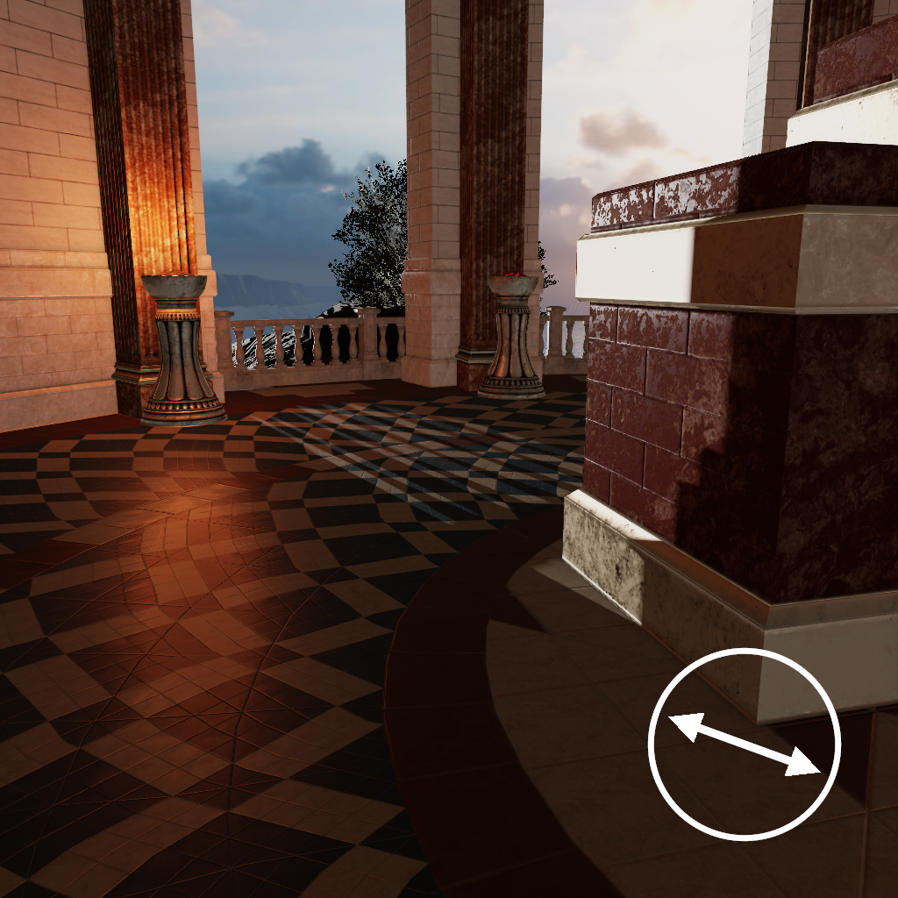
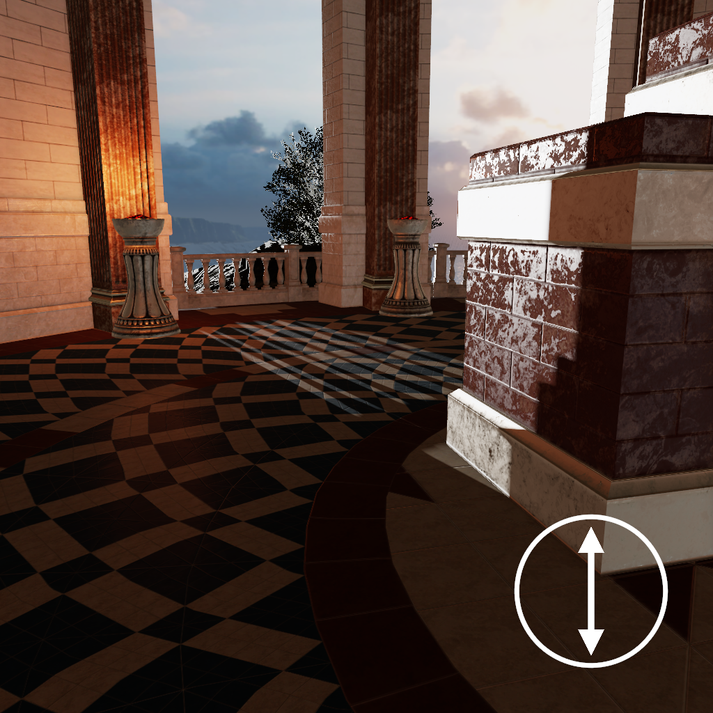
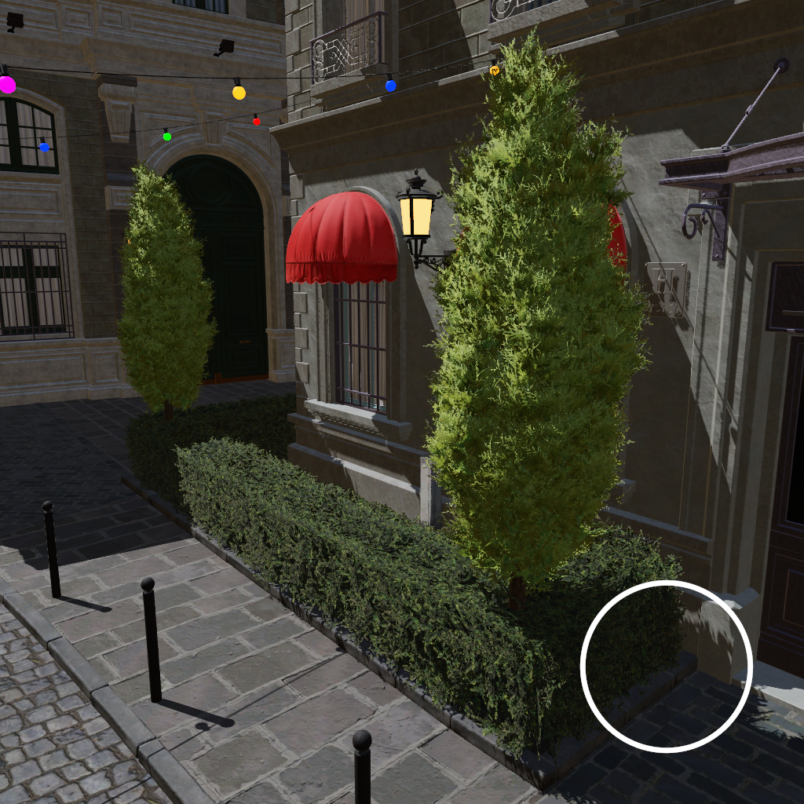
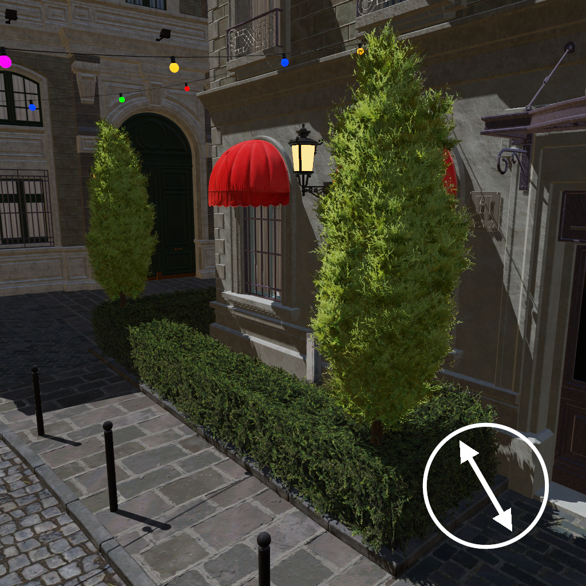
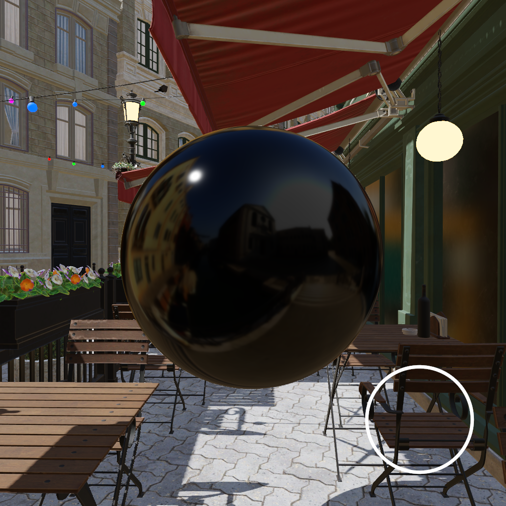
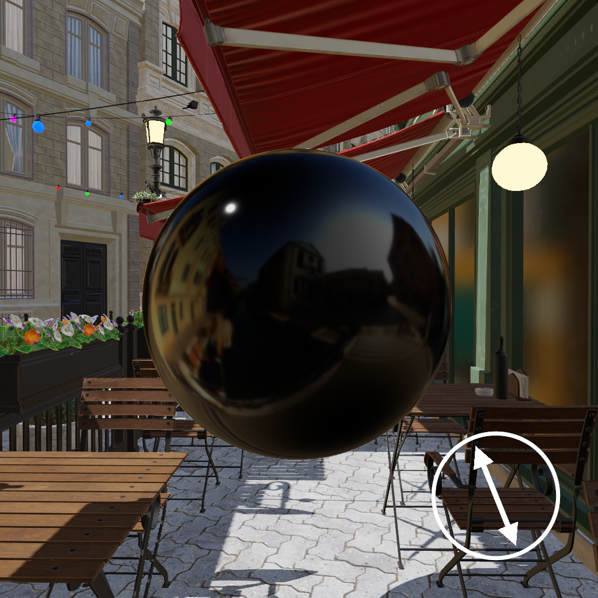
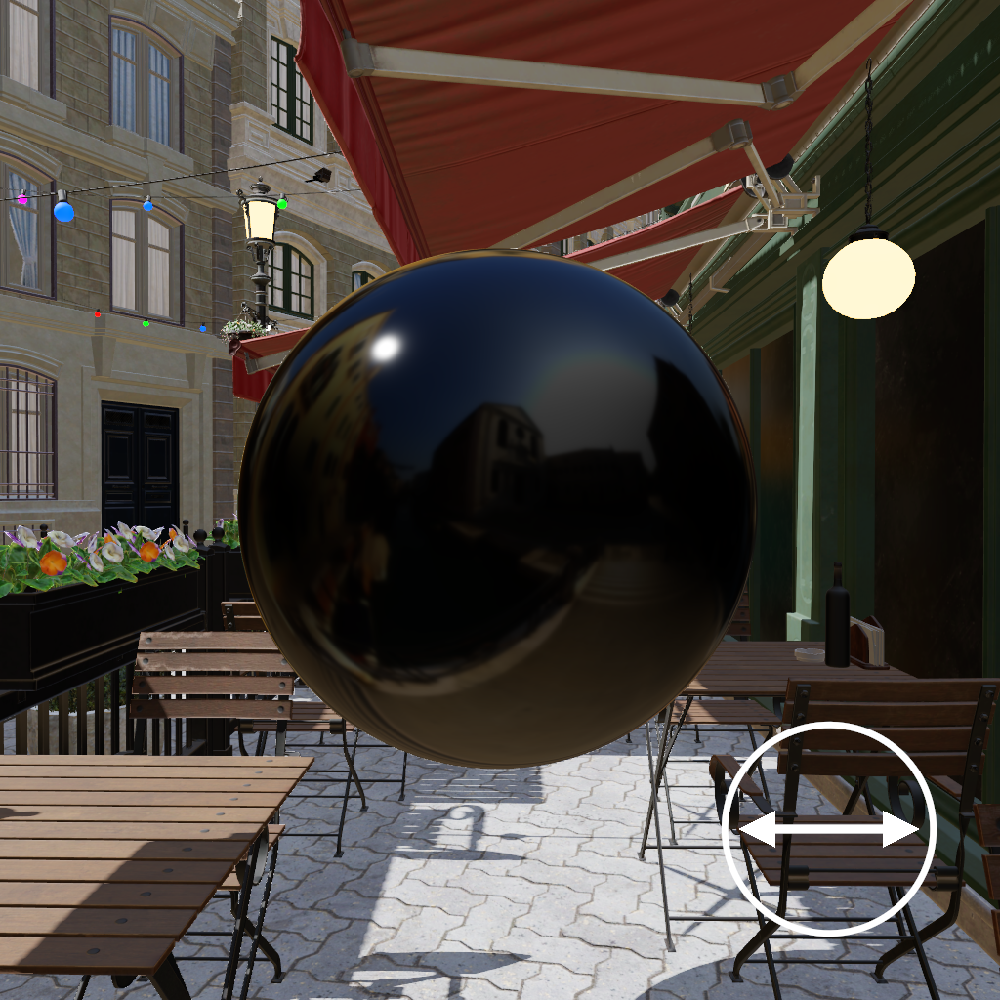

A Polarizing Filter Function for Real-Time Rendering
====
This repository hosts the source code of the example application used in the article _A Polarizing Filter Function for Real-Time Rendering_.


Polarizing Filter Demonstration
----
<p align="center">

|   |   |   |
|:-:|:-:|:-:|
| <br />unfiltered| <br />filter angle = 160&deg; | <br />filter angle = 90&deg;|
| <br />unfiltered| <br />filter angle = 120&deg; | <br />filter angle = 30&deg;|
| <br />unfiltered| <br />filter angle = 112&deg; | <br />filter angle = 0&deg;|

</p>

Projects and Settings
----


This implmeentation is based on [Nvidia's Falcor Rendering Framework 3.2.2](https://github.com/NVIDIAGameWorks/Falcor/tree/f2b53b1bb9f8433f3c9e2570d2dc90dcd2440415) and adds the following projects.
- **_PolarizingFilterRenderer_** A copy of Falcor's _ForwardRenderer_ with an included polarizing filter.
	- **Settings**
		- Polarizing Filter
			- _Filter angle_ - The counterclockwise rotation angle of the linear polarizing filter in degrees, with `0` repressenting a horizontally angled filter.
- **_MaterialRenderer_** Can be used to compare the effect of our approximate function with the correct IOR-based function (see the article for more details). All surfaces use the same material in this mode.
	- **Settings**
		- Polarizing Filter
			- _Filter angle_ - Same as in _PolarizingFilterRenderer_.
			- _Reference version_ - Use the IOR-based version of the filter instead the approximate version.
			- _Show difference_ - Visualize the exaggerated difference between the reference version and our specular color version.
		- Custom Material
			- _Presets_ - Select material values from a predefined list of materials.
			- _IoR n_ - The simple refractive index for RGB color channels.
			- _IoR k_ - The extinction coefficient for RGB color channels.
			- _Roughness_ - Linear roughness value.
			- _Use as dielectric_ - Material will have a metalness value of `0` when using the approximate version of the filter.

Polarizing Filter Source Code
----
The HLSL implementation code of the polarizing filter can be found in LINK, see the article for more details.

Requirements and Installation
----
Follow the installation guide for [Falcor 3.2.2](https://github.com/NVIDIAGameWorks/Falcor/tree/f2b53b1bb9f8433f3c9e2570d2dc90dcd2440415) if you want to build this project. 
The same restrictions and requirements apply.

Additional test scenes can be downloaded from the [Open Research Content Archive (ORCA)](https://developer.nvidia.com/orca). You might have to edit some path names in the code for them to load correctly.
Scenes can also be created/modified with the included `SceneEditor` project.

Versions
-----
- [`v1.00`](https://github.com/viktor4006094/DegreeProject/releases/tag/v1.00) Version used to run the performance tests in the article

Citation
--------

### Article
TODO

### Application
```bibtex
@Misc{EnfeldtPolarizing2020,  
   author = {Enfeldt, Viktor},  
   title  = {A Polarizing Filter Function For Real-Time Rendering},  
   year   = {2020},  
   month  = {08},  
   url    = {https://github.com/viktor4006094/FresnelPolarizingFilter},    
}
```
